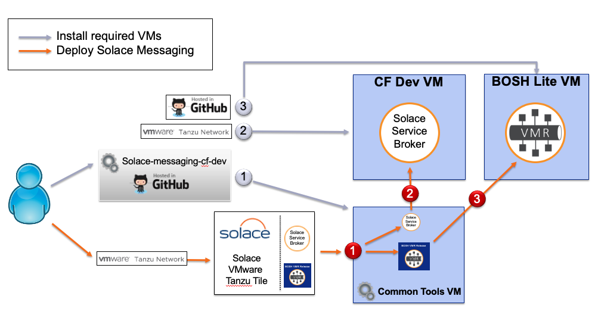
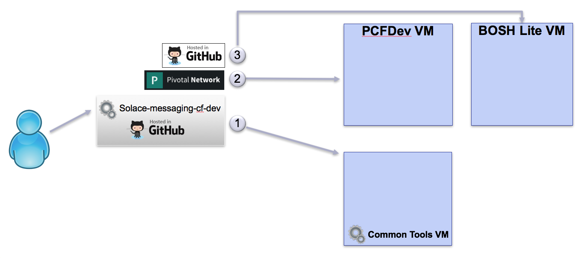
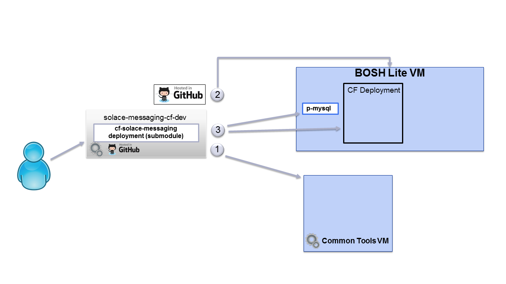
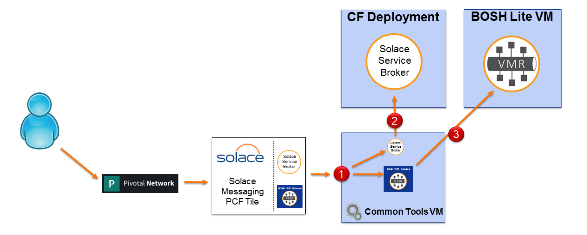

# SOLACE-MESSAGING-CF-DEV

This project provides instructions and tools that support local development and testing of Solace Messaging for Cloud Foundry.

## Table of Contents:

* [About](#about)
* [Operating System](#operating-system)
* [Hardware Requirements](#hardware-requirements)
* [Installation Requirements](#installation-requirements)
* [Installation on Windows](#installation-on-windows)
  * [Overview of Windows Deployment](#windows-overview)
  * [Installation Steps on Windows](#installation-steps-on-windows)
* [Installation on Linux](#installation-on-linux)
  * [Overview of Linux Deployment](#linux-overview)
  * [Installation Steps on Linux](#installation-steps-on-linux)
* [Solace Messaging Deployment](#solace-messaging-deployment)
* [Other useful commands and tools](#other-useful-commands-and-tools)

# About

A Deployment Solace Messaging for Cloud Foundry has prerequisites for which this guide will provide steps to satisfy:

- A deployment of [BOSH](https://github.com/cloudfoundry/bosh) or [BOSH-lite](https://github.com/cloudfoundry/bosh-lite): Hosting the VMRs
- A deployment of [Cloud Foundry](https://github.com/cloudfoundry/cf-deployment): Hosting the Solace Service Broker and Test Applications.
- A deployment of [Cloud Foundry MySQL](https://github.com/cloudfoundry/cf-mysql-deployment): Provides p-mysql service required by the Solace Service Broker
- A [Solace BOSH Deployment](https://github.com/SolaceDev/cf-solace-messaging-deployment/): Defines and produces the bosh manifests to deploy Solace Messaging for Cloud Foundry

# Operating system

This project and its tools will support a deployment on Windows, Linux and Mac.

Any instructions given for Linux will work on Mac.

This guide will provide different steps for deploying on Windows than Linux ( Mac ).

The following issues have been noted and addressed in this guide:

- Windows is not yet supported by [bosh create-env](https://github.com/cloudfoundry/bosh/issues/1821)
  - Workaround: use the old [Vagrant based BOSH-lite](https://github.com/cloudfoundry/bosh-lite/blob/master/docs/README.md). 
- CF logging features do not work on a deployment of [Cloud Foundry](https://github.com/cloudfoundry/cf-deployment) to the [Vagrant based BOSH-lite](https://github.com/cloudfoundry/bosh-lite/blob/master/docs/README.md)
  - Workaround: use [PCF-Dev](https://pivotal.io/pcf-dev) to host the CF deployment and cf-mysql. 

# Hardware Requirements

Each of the following requirements for tools and software products needs to be satisfied.

A key goal is to keep what is installed directly on your host computer to a minimum, while containing everything else inside VMs.
With this approach we keep a high level of containment within VMs and isolation from the host system.

RAM is biggest requirement, 16GB is the minimum, and 32GB is preferred.

You will also need at least 40GB of free disk space.

# Installation Requirements

While there may be no need for internet access once the setup is completed, it is certainly required during the setup.
All the steps during the setup will access the internet to download and install correctly.

Directly on your computer, you must have or get the following:

* Install latest [Git](https://git-scm.com/downloads) (version 2.7.1+)
* Install latest [Virtual Box](https://www.virtualbox.org/wiki/Downloads) (version 5.2.6+)
* Install latest [Vagrant](https://www.vagrantup.com/downloads.htm) (version 2.0.1+)
* Shell access, use your preferred shell.
 
If you are installing this in a VM you will need to ensure that:

* Intel VT-x/EPT or AMD-RVI Virtualization is enabled.

 

# Installation on Windows

## Overview of Windows Deployment

Here is an overview of what this project will help you install if you are using a windows deployment:

This guide will help you install the following VMs:

* cli-tools to provide a reliable environment to run the scripts of this project.
  - Tested with 512mb of ram, just enough to run some scripts.
  - You may wish to increase the ram if you want to test applications from this VM. The setting for ram is in [config.yml](cli-tools/config.yml).
* PCF-Dev for hosting the solace service broker and your applications.
  - Tested with 4GB, but you may size to suite your needs for hosting for your apps.
* BOSH-lite for hosting VMRs.
  - Size as recommended below to fit the VMRs.

## Installation Steps on Windows

The goal of the installation steps is to start the required VMs on Windows.

_The setup was last tested on Windows host with 32GB of RAM, using:_
- git version 2.8.2.windows.1
- cf version 6.21.1+6fd3c9f-2016-08-10
- Vagrant 1.9.1
- VirtualBox Version 5.1.10 r112026 (Qt5.6.2)

### Installation on Windows - Step 1 - Clone this project and start up its cli-tools vm

On your computer, clone this project and start up the cli-tools vm. We will come back to use it in later steps.

~~~~
git clone https://github.com/SolaceLabs/solace-messaging-cf-dev.git
cd solace-messaging-cf-dev
cd cli-tools
vagrant up
~~~~

Just an example on how to run commands in cli-tools vm, which you need to do later.
~~~~
cd solace-messaging-cf-dev
cd cli-tools
vagrant ssh

echo "I am running inside cli-tools vm"
exit
~~~~

_The cli-tools VM will contains all the necessary tools to run the scripts of this project, including 
another clone of this project. The workspace folder visible on your computer is shared with the cli-tools VM._

### Installation on Windows - Step 2 - PCF-Dev

PCF-Dev provides a local installation of cloud foundry in a box to help test applications.

Using PCF-Dev you can install and test applications, bind to services that are available in PCF-Dev.

You can also add services to PCF-Dev, such as solace-messaging and use solace-messaging with your applications.

Our goal is to to add solace-messaging as a service in PCF-Dev.

You need to install [PCF-Dev](https://pivotal.io/pcf-dev). Please follow these instructions:

* Install [cf cli - The Cloud Foundry Command Line Interface](https://pivotal.io/platform/pcf-tutorials/getting-started-with-pivotal-cloud-foundry-dev/install-the-cf-cli)
* Install [PCF Plugin which is used by cf cli](https://pivotal.io/platform/pcf-tutorials/getting-started-with-pivotal-cloud-foundry-dev/install-pcf-dev) 
* Start PCF-Dev, using 4GB of ram. You may choose to adjust this.

~~~~
cf dev start -m 4096
~~~~

At this point PCF-Dev is locally installed and ready to host applications and services.

Optionally, you may follow the full [Getting started with pivotal cloud foundry introduction guide](https://pivotal.io/platform/pcf-tutorials/getting-started-with-pivotal-cloud-foundry-dev/introduction), as you would learn how to install a test application in PCF-Dev.

### Installation on Windows - Step 3 - BOSH-lite

We will use [BOSH-lite](https://github.com/cloudfoundry/bosh-lite) to deploy the Solace VMR(s).

But first you need to install [BOSH-lite](https://github.com/cloudfoundry/bosh-lite):

* By now you have already installed  [Virtual Box](https://www.virtualbox.org/wiki/Downloads) and [Vagrant](https://www.vagrantup.com/downloads.htm).
* Clone bosh-lite in the workspace of this project.

~~~
cd solace-messaging-cf-dev
cd workspace
git clone https://github.com/cloudfoundry/bosh-lite
cp ../bin/create_swap.sh bosh-lite
cd bosh-lite
~~~

* Then start bosh-lite:
  - Use VM_MEMORY=5000 if you want to host a single VMR
  - Use VM_MEMORY=15000 if you want to host 3 VMRs that can form an HA Group
  - In general, use VM_MEMORY=5000 * [Number-of-VMRs]
  - Also note the additional swap space, use 2048 Mb per VMR.

~~~
set VM_MEMORY=5000
vagrant up --provider=virtualbox
vagrant ssh -c "sudo /vagrant/create_swap.sh 2048 additionalSwapFile"
~~~

* VERY IMPORTANT: enable routing so communication can work between your hosting computer and the VMs, one of these should work for you.
  - bosh-lite/bin/add-route
  - bosh-lite/bin/add-route.bat

_Without enabled routing, the VMs will not be able to communicate. You will have re-run the add-route* scripts if you reboot your computer_

You are now ready for a [Solace Messaging Deployment](#solace-messaging-deployment)

# Installation on Linux

## Overview of Linux Deployment

The goal of the installation is to prepare the required deployments.

This guide will help you install and deploy the following:

* cli-tools to provide a reliable environment to run the scripts of this project.
  - Tested with 512mb of ram, just enough to run some scripts.
  - You may wish to increase the ram if you want to test applications from this VM. The setting for ram is in [config.yml](cli-tools/config.yml).
* BOSH-lite for hosting CF, CF-MYSQL, Solace VMRs.
  - Size as recommended below to fit the VMRs.
* A Deployment of CF and CF-MYSQL to BOSH-lite.

The setup was last tested on:

_Linux host with 64GB of RAM, using:_
- git version 1.8.3.1
- Vagrant 1.9.7
- VirtualBox Version 5.1.22 r115126 

_Mac host with 16GB of RAM, using:_
- git version 2.15.1
- Vagrant 2.0.1
- VirtualBox Version 5.2.6

# Installation Steps on Linux

These steps are also applicable on a Mac.

### Installation on Linux - Step 1 - Clone this project and start up its cli-tools vm

On your computer, clone this project and start up the cli-tools vm. We will come back to use it in later steps.

~~~~
git clone https://github.com/SolaceLabs/solace-messaging-cf-dev.git
cd solace-messaging-cf-dev
~~~~

Startup the cli-tools vm. 

~~~~
cd cli-tools
vagrant up
~~~~

Just an example on how to run commands in cli-tools vm, which you need to do later.
~~~~
cd solace-messaging-cf-dev
cd cli-tools
vagrant ssh

echo "I am running inside cli-tools vm"
exit
~~~~

_The cli-tools VM will contains all the necessary tools to run the scripts of this project, including 
another clone of this project. The workspace folder visible on your computer is shared with the cli-tools VM._

_The cli-tools VM is optional on Linux and Mac if you install the required tools: TODO_

### Installation on Linux - Step 2 - BOSH-lite VM

A quick way to get started with BOSH is to use [BUCC](https://github.com/starkandwayne/bucc), it provides a convenient wrapper around a [bosh-deployment](https://github.com/cloudfoundry/bosh-deployment).

To set BOSH-lite please use [bin/setup_bosh_lite_vm.sh](bin/setup_bosh_lite_vm), this script will do the following:

* Download and set up the bucc cli
* Create the BOSH-lite VM
* Create additional swap space on the BOSH-lite VM
* Enable routing so that your hosting computer can communicate with the VMs hosting BOSH-lite

* The following environment variable parameters are available to adjust the size of the BOSH-lite VM when creating it.
  - VM_MEMORY=8192 is the default: it is enough to support the deployment of CF, CF-MYSQL and a single VMR
  - VM_SWAP=8192 is the default: it is enough to support up to 4 VMRs before needing to add more.
  - VM_DISK_SIZE=65_536 is the default: it is enough to support up to 4 VMRs before needing more storage.
  - VM_EPHEMERAL_DISK_SIZE=32_768 is the default: it provides enough room to spare for multiple deployments and re-deployment. You should not need to adjust this.
  - In general under a BOSH-lite deployment you should add 4000 Mb to VM_MEMORY and 2000 Mb to VM_SWAP per additional VMR.

~~~~
cd bin
./setup_bosh_lite_vm.sh 
~~~~

### Installation on Linux - Step 3 - Deploy CF and cf-mysql 

To deploy CF and cf-mysql in BOSH-lite to host the Solace service broker and other applications:

* Run [cf_deploy.sh](bin/cf_deploy.sh). This script will deploy cf from this repository: [cf-deployment](https://github.com/cloudfoundry/cf-deployment). 
* Run [cf_mysql_deploy.sh](bin/cf_mysql_deploy.sh). This script will deploy cf-mysql from this repository: [cf-mysql-deployment](https://github.com/cloudfoundry/cf-mysql-deployment).

~~~~
cd bin
./cf_deploy.sh 
./cf_mysql_deploy.sh 
~~~~ 

You are now ready for a [Solace Messaging Deployment](#solace-messaging-deployment)

# Solace Messaging Deployment

The goal of the deployment steps is to install Solace Messaging into the running CF environment.

### Deployment - Prerequisites

#### The Solace Pivotal Tile

* The Solace Pivotal Tile is available for download from [PivNet](https://network.pivotal.io/products/solace-messaging/).
* [Solace Pivotal Tile Documentation](http://docs.pivotal.io/partners/solace-messaging/)
  - _You may use Solace Tiles for which we have matching [templates](./templates), 
   Installation will not work without templates to match the tile version_

Please download the Solace Pivotal Tile and keep it around for later use. 

For my example I have downloaded version 1.4.0 and placed it in:

~~~~
solace-messaging-cf-dev/workspace/solace-messaging-1.4.0.pivotal
~~~~

#### Login to cli-tools VM

All deployment steps require you to be logged in to the cli-tools VM 

~~~~
cd solace-messaging-cf-dev
cd cli-tools
vagrant ssh
~~~~

### Deployment Step 1 - Extract the bosh releases from the Solace Pivotal Tile

The pivotal file is a zip file. We need to extract the relevant bosh releases needed for this deployment.

Do the following to extract the tile contents:

~~~~
extract_tile.sh -t solace-messaging-1.4.0.pivotal
~~~~

You will find the relevant contents extracted to ~/workspace/releases

### Deployment Step 2 - Upload the bosh releases to BOSH-lite

To upload the extracted bosh releases to BOSH-lite.

~~~~
solace_upload_releases.sh
~~~~

### Deployment Step 3 - Deploy 

This will deploy the VMR(s) to BOSH-lite and run an bosh errand to deploy the Solace Service Broker and add solace-messaging as a service in Cloud Foundry.

_If not sure what to pick just use the default with no parameters. Otherwise, please ensure that you have allocated enough memory to the BOSH-lite VM for the number and types of VMRs that you want to deploy_

 - On Linux: 

**Example:** Deploy the default which is a single instance of a Shared-VMR using a self-signed server certificate and evaluation vmr edition.
~~~~
./solace_deploy.sh
~~~~

The deployment property file used as default can be found under [templates](templates/1.4.0/),  you can make a copy and edit it.

**Example:** Use a customized deployment property file from which a new bosh-manifest will be generated. 
~~~~
cd solace-messaging-cf-dev/bin
./deployer.sh -c custom_properties.yml
~~~~

 - On Windows: 

TODO: FIX THIS, no manual steps..

To deploy on windows you will need to modify the deploy script (solace_deploy.sh) in bin/dev in the bosh command to use the windows operations file, and change the domains to local.pcfdev.io. More details on this in the [operations](operations) directory. Once this script has been modified, you can use it to deploy on windows with a separate PCF-Dev VM, or just run the bosh deploy command directly. 

_The current deployment can be updated by simply rerunning the deployment script._

## Using the Deployment

At this stage, solace-messaging is a service in the CF Deployment, and the BOSH-lite VMR deployment will auto register with the service broker
and become available for use in CF.

_You can use 'cf' from cli-tools, or directly from your host computer, they both access the same CF instance_

For example if you deployed the default Shared-VMR, a "shared" service plan will be available and you can do this:

~~~~
cf m
cf create-service solace-messaging shared solace-messaging-demo-instance
cf services
~~~~

Ideally you will bind the service you created to an application and use it.
You can go ahead download and test the [Solace Sample Apps](https://github.com/SolaceLabs/sl-cf-solace-messaging-demo), or create some of your own.

# Other useful commands and tools

## How to login and access CF

On Windows: 

~~~~
cf api https://api.local.pcfdev.io --skip-ssl-validation
cf auth admin admin
~~~~

On Linux: 

This can be executed in the cli-tools vm or locally. 
If it is ran locally it needs to run inside the solace-messaging-cf-dev/bin directory.
~~~
./cf_env.sh 
~~~

## How to see what is offered in the marketplace

~~~~
cf marketplace
~~~~

Or better yet, in short form:
~~~~
cf m
~~~~

## Service Broker

You can use your browser to examine the deployed service broker dashboard: 

* On Windows, having PCF-Dev deployed service broker
  * [ service broker dashboard ](http://solace-messaging.local.pcfdev.io/)
  * You will need a username and password: solacedemo is the default as set for this deployment.

* On Linux, having service broker deployed on CF-Deployment
  * [ service broker dashboard ](http://solace-messaging.bosh-lite.com/)
  * You will need a username and password, do the following to discover the generated solace_broker_user and solace_broker_password

~~~~
solace_broker_user=$(bosh int $WORKSPACE/deployment-vars.yml --path /solace_broker_user)
solace_broker_password=$(bosh int $WORKSPACE/deployment-vars.yml --path /solace_broker_password)
echo "solace_broker_user: $solace_broker_user       solace_broker_password: $solace_broker_password"
~~~~

You can also run a script that will fetch a variety of information from the service broker
~~~~
getServiceBrokerInfo.sh
~~~~

## To use TCP Routing feature

TCP Routing feature is available only on the Linux deployment.

In the cli-tools vm you can run this script to set up the solace router uaa client and the tcp domain. 

TODO: Rename this script? - move it to be part of deployment steps.
~~~
solace_prepare_cf.sh
~~~

## How to suspend and resume VMs

The VMs we created can be suspended and resumed at a later time.
This way you don't need to recreate them. Their state is saved to disk.

### Suspending all VMS

* On Windows: 

~~~~
cd solace-messaging-cf-dev

cd cli-tools
vagrant suspend

cd ../workspace/bosh-lite
vagrant suspend

cf dev suspend
~~~~

* On Linux: 

~~~~
cd solace-messaging-cf-dev

cd cli-tools
vagrant suspend
~~~~ 

The bosh created VM in virtualbox cannot be successfully restarted.  But they can be preserved by pausing and saving their state in virtualbox. 

~~~~ 
suspend_bosh_lite_vm.sh
~~~~ 

Alternatively you can use the virtualbox GUI to 'pause' and 'close' > 'save state'. 

### Resuming all VMS

* On Windows: 

~~~~
cd solace-messaging-cf-dev

cd cli-tools
vagrant resume

cd ../workspace/bosh-lite
vagrant resume

cf dev resume
~~~~

* On Linux: 

~~~~
cd solace-messaging-cf-dev

cd cli-tools
vagrant resume
~~~~

The bosh created VM in virtualbox may be resumed if previously paused and saved by using [suspend_bosh_lite_vm.sh](bin/suspend_bosh_lite_vm.sh)

~~~~
resume_bosh_lite_vm.sh
~~~~

Alternatively you can use the virtualbox GUI to the 'start' > 'headless start'. 

## Working with VMR in the BOSH deployment

### Listing the VMs

From the cli-tools vm:

~~~~
bosh vms
~~~~

### Access the VMR cli

Get the list of vms, to find the IP address of the VMR instance you want:
~~~~
bosh vms
~~~~

Now ssh to the VMR. The admin password is whatever you had set in the vars.yml and the SSH port on this BOSH-lite deployment is set to 3022.

~~~~
ssh -p 3022 admin@10.244.0.150
~~~~

## How to cleanup

### Deleting the Solace Messaging deployment

From the cli-tools vm:
~~~~
solace_delete_deployment.sh
~~~~

### How to delete BOSH-lite VM

On your host computer (not cli-tools)

* On Windows

~~~~
cd solace-messaging-cf-dev
cd workspace
cd bosh-lite
vagrant destroy
~~~~

* On Linux, this will destroy the VM for BOSH-lite which also contains CF, and CF-MYSQL

~~~~
destroy_bosh_lite_vm.sh 
~~~~

### How to delete cli-tools VM

On your host computer (not cli-tools)

* For both Windows and Linux

~~~~
cd solace-messaging-cf-dev
cd cli-tools
vagrant destroy
~~~~

### How to delete PCF-Dev

* On Windows to delete PCF-Dev

On your host computer (not cli-tools)

~~~~
cf dev destroy
~~~~

