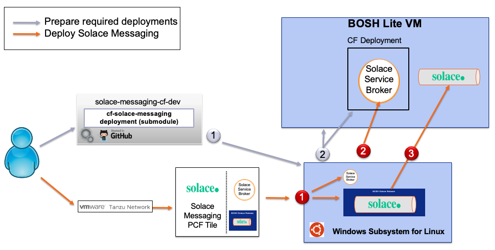
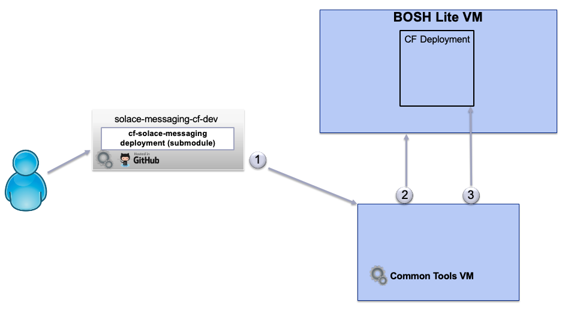

PUBSUBPLUS-CF-DEV

This project provides instructions and tools that support local development and testing of Solace PubSub+ for Cloud Foundry.

## Table of Contents:

* [About](#about)
* [Operating System](#operating-system)
* [Hardware Requirements](#hardware-requirements)
* [Installation Requirements](#installation-requirements)
* [Installation on Windows](#installation-on-windows)
  * [Overview of Windows Deployment](#windows-overview)
  * [Installation Steps on Windows](#installation-steps-on-windows)
* [Installation on Linux](#installation-on-linux)
  * [Overview of Linux Deployment](#linux-overview)
  * [Installation Steps on Linux](#installation-steps-on-linux)
* [Solace PubSub+ Deployment](#solace-pubsub-deployment)
* [Other useful commands and tools](#other-useful-commands-and-tools)

# About

A Deployment of Solace PubSub+ for Cloud Foundry has prerequisites for which this guide will provide steps to satisfy:

- A deployment of [BOSH](https://github.com/cloudfoundry/bosh): Hosting the Solace PubSub+ software event brokers
- A deployment of [Cloud Foundry](https://github.com/cloudfoundry/cf-deployment): Hosting the Solace Service Broker and Test Applications.
- Optionally a deployment of [Cloud Foundry MySQL](https://github.com/cloudfoundry/cf-mysql-deployment): Provides p-mysql service required by the Solace Service Broker. By default this is not needed - the service broker uses an internal instance.
- A [Solace BOSH Deployment](https://github.com/SolaceLabs/cf-pubsubplus-deployment/): Defines and produces the bosh manifests to deploy Solace PubSub+ for Cloud Foundry

# Operating system

This project and its tools will support a deployment on Linux, Mac and the Windows Subsystem for Linux (WSL) which is available on Windows 10 and later.

Any instructions given for Linux will work on Mac and the WSL.

This guide will provide different steps for deploying on Windows than on Linux or Mac.

# Hardware Requirements

Each of the following requirements for tools and software products needs to be satisfied.

A key goal is to keep what is installed directly on your host computer to a minimum, while containing everything else inside VMs and the WSL.
With this approach we keep a high level of containment within VMs and isolation from the host system.

RAM is biggest requirement, 16GB is the minimum, and 32GB is preferred.

You will also need at least 40GB of free disk space.

# Installation Requirements

While there may be no need for internet access once the setup is completed, it is certainly required during the setup.
All the steps during the setup will access the internet to download and install correctly.

Directly on your computer, you must have or get the following:

* Install latest [Git](https://git-scm.com/downloads) (version 2.7.1+)
* Install latest [Virtual Box](https://www.virtualbox.org/wiki/Downloads) (version 5.2.6+)
* Unless you are installing on WSL, you will also need the latest [Vagrant](https://www.vagrantup.com/downloads.html) (version 2.0.1+)
* Shell access, use your preferred shell.
 
If you are installing this in a VM you will need to ensure that:

* Intel VT-x/EPT or AMD-RVI Virtualization is enabled.

# Installation on Windows

## Overview of Windows Deployment

Here is an overview of what this project will help you install if you are using a Windows deployment:

* The BOSH-lite VM for hosting PubSub+.
  - Size as recommended below to fit the Solace PubSub+ software event brokers.
* The CF deployment, running in the Bosh-lite VM.

## Installation Steps on Windows

The goal of the installation steps is to start the required VMs on Windows.

_The setup was last tested on Windows host with 32GB of RAM, using:_
- WSL with Ubuntu 18.04
- cf version 6.38.0+7ddf0aadd.2018-08-07
- VirtualBox Version 5.2.18r124329

### Installation on WSL - Step 1 - Install the Windows Subsystem for Linux

Ensure VirtualBox is installed.

Follow the [WSL installation instructions](https://docs.microsoft.com/en-us/windows/wsl/install-win10) and select the Ubuntu distribution.

### Installation on Windows - Step 2 - Set up the network route to the bosh vms.

This enables routing so communication can work between your hosting computer and the VMs.

In a Windows Administrator CMD console, run:

~~~
route add 10.244.0.0/19 192.168.50.6
~~~

_Without enabled routing, the VMs will not be able to communicate. You will have re-run this if you reboot your computer_

### Installation on Windows - Step 3 - Log into the WSL

Type Ubuntu into the Windows search tool and click the Ubuntu icon to start a bash shell.

### Installation on Windows - Step 4 - Run the installer that sets up Bosh and CF

This project provides a script that installs bosh. It assumes certain file locations and other settings. These can be overridden by environment variables. These variables with their defaults are:

  - BRANCH The git branch of this project, and the cf-pubsubplus-deployment subproject, that will get checked out the first time this project is cloned by the installation script. If it is not set then the script will not switch branches. 
  - GIT_REPO_BASE=https://github.com/SolaceLabs - this is where this project is located in Github.
  - REPOS_DIR=$HOME/repos - this is the parent directory of the the local clone of this project.
  - VM_MEMORY=8192 - the size of the Virtual Machine that will host bosh. The default is large enough to support the deployment of CF, CF-MYSQL and a single PubSub+ instance
  - VM_SWAP=8192 This is the size of the VM's swap file. The default is large enough to support up to 4 PubSub+ instances before needing to add more.
  - VM_DISK_SIZE=65_536 - the VM's disk size. The default is enough to support up to 4 PubSub+ instances before needing more storage.
  - VM_EPHEMERAL_DISK_SIZE=32_768 The ephemeral disk size. The default provides enough room to spare for multiple deployments and re-deployment. You should not need to adjust this.
  - WIN_DRIVE=/mnt/c - this is the mounted Windows drive (C: or D: etc.)
  - VIRTUALBOX_HOME=$WIN_DRIVE/Program Files/Oracle/VirtualBox - this is where the script looks for the VirtualBox executables.
  - In general under a BOSH-lite deployment you should add 4000 Mb to VM_MEMORY and 2000 Mb to VM_SWAP per additional PubSub+ instance.

That script will install ruby and other required programs and libraries, clone the repository if it's not already cloned, create the bosh virtual machine and deploy Cloud Foundry.

The script also calls another script, bosh_lite_vm.sh, which downloads and uses [BUCC](https://github.com/starkandwayne/bucc). That provides a convenient wrapper around a [bosh-deployment](https://github.com/cloudfoundry/bosh-deployment).

Finally it will give you the option to add a couple of commands to your .profile so that when you log in after the deploy is finished, the bosh and cf environment will automatically get set up, and it will log you into cf.

There are two ways of running the script:

#### Option 1: Directly through curl:

~~~
curl -L https://github.com/SolaceLabs/pubsubplus-cf-dev/raw/master/bin/setup_linux_on_wsl.sh | bash
~~~

With this option, this project will automatically get cloned and git will check out the branch specified by the BRANCH environment variable if it is set.

#### Option 2: Manually cloning the repository

First ensure that the directory corresponding to the REPOS_DIR environment variable exists, and cd to that directory (the default is $HOME/repos). Then clone this project and run the script:
~~~
cd
mkdir repos
cd repos
git clone https://github.com/SolaceLabs/pubsubplus-cf-dev/
pubsubplus-cf-dev/bin/setup_linux_on_wsl.sh
~~~

The script allows for command line arguments to select which part of the installation is run.
Multiple steps can be selected together (example: -pbc). By default, the script runs all of the
installation steps.
~~~
-p Runs pre install commands that are necessary for BOSH and CF
-b Installs BOSH
-c Installs CF ontop of BOSH
~~~

The script allows for command line arguments to select which part of the installation is run.
Multiple steps can be selected together (example: -pbc). By default, the script runs all of the
installation steps.
~~~
-p Runs pre install commands that are necessary for BOSH and CF
-b Installs BOSH
-c Installs CF ontop of BOSH
~~~

With this option, the script **will not** switch to the git branch specified by the BRANCH environment variable.

Once that is complete then you can deploy Solace as per [these instructions](#solace-pubsub-deployment). Note that it is not necessary to use the cli-tools vagrant virtual machine - the commands should work fine running under WSL.

# Installation on Linux

## Overview of Linux Deployment

The goal of the installation is to prepare the required deployments.

This guide will help you install and deploy the following:

* cli-tools to provide a reliable environment to run the scripts of this project.
  - Tested with 512mb of ram, just enough to run some scripts.
  - You may wish to increase the ram if you want to test applications from this VM. The setting for ram is in [config.yml](cli-tools/config.yml).
* BOSH-lite for hosting CF, Solace PubSub+ software event brokers and optionally CF-MYSQL.
  - Size as recommended below to fit the PubSub+ instances.
* A Deployment of CF and optionally CF-MYSQL to BOSH-lite.

The setup was last tested on:

_Linux host with 64GB of RAM, using:_
- git version 1.8.3.1
- Vagrant 1.9.7
- VirtualBox Version 5.1.22 r115126 

_Mac host with 16GB of RAM, using:_
- git version 2.15.1
- Vagrant 2.0.1
- VirtualBox Version 5.2.6

# Installation Steps on Linux

These steps are also applicable to Macs.

### Installation on Linux - Step 1 - Clone this project and start up its cli-tools vm

On your computer, clone this project and start up the cli-tools vm. We will come back to use it in later steps.

~~~~
git clone https://github.com/SolaceLabs/pubsubplus-cf-dev.git
cd pubsubplus-cf-dev
git submodule init
git submodule update
~~~~

Startup the cli-tools vm. 

~~~~
cd cli-tools
vagrant up
~~~~

Just an example on how to run commands in cli-tools vm, which you need to do later.
~~~~
cd pubsubplus-cf-dev
cd cli-tools
vagrant ssh

echo "I am running inside cli-tools vm"
exit
~~~~

_The cli-tools VM will contains all the necessary tools to run the scripts of this project, including 
another clone of this project. The workspace folder visible on your computer is shared with the cli-tools VM._

### Installation on Linux - Step 2 - BOSH-lite VM

A quick way to get started with BOSH is to use [BUCC](https://github.com/starkandwayne/bucc), it provides a convenient wrapper around a [bosh-deployment](https://github.com/cloudfoundry/bosh-deployment).

To set BOSH-lite please use [bin/bosh_lite_vm.sh -c](bin/bosh_lite_vm.sh), the '-c' create option will do the following:

* Download and set up the bucc cli
* Create the BOSH-lite VM
* Create additional swap space on the BOSH-lite VM
* Enable routing so that your hosting computer can communicate with the VMs hosting BOSH-lite

* The following environment variable parameters are available to adjust the size of the BOSH-lite VM when creating it.
  - VM_MEMORY=8192 is the default: it is enough to support the deployment of CF, CF-MYSQL and a single event broker
  - VM_SWAP=8192 is the default: it is enough to support up to 4 event brokers before needing to add more.
  - VM_DISK_SIZE=65_536 is the default: it is enough to support up to 4 event brokers before needing more storage.
  - VM_EPHEMERAL_DISK_SIZE=32_768 is the default: it provides enough room to spare for multiple deployments and re-deployment. You should not need to adjust this.
  - In general under a BOSH-lite deployment you should add 4000 Mb to VM_MEMORY and 2000 Mb to VM_SWAP per additional event broker.

~~~~
cd bin
./bosh_lite_vm.sh -c
~~~~

### Installation on Linux - Step 3 - Deploy CF

To deploy CF in BOSH-lite to host the Solace service broker and other applications:

* Run [cf_deploy.sh](bin/cf_deploy.sh). This script will deploy cf from this repository: [cf-deployment](https://github.com/cloudfoundry/cf-deployment). 

~~~~
cd bin
./cf_deploy.sh 
~~~~ 

You are now ready for a [Solace PubSub+ Deployment](#solace-pubsub-deployment)

# Solace PubSub+ Deployment

The goal of the deployment steps is to install Solace PubSub+ into the running CF environment.

### Deployment - Prerequisites

#### The Solace Pivotal Tile

* The Solace Pivotal Tile is available for download from [PivNet](https://network.pivotal.io/products/pubsubplus/).
* [Solace Pivotal Tile Documentation](http://docs.pivotal.io/partners/solace-pubsub/)
  - _You may use Solace Tiles for which we have matching [templates](./templates), 
   Installation will not work without templates to match the tile version_

Please download the Solace Pivotal Tile and keep it around for later use. 

For example, downloaded version 2.0.0 and placed it in:

~~~~
pubsubplus-cf-dev/workspace/solace-pubsub-2.0.0.pivotal
~~~~

#### Login to cli-tools VM

All deployment steps require you to be logged in to the cli-tools VM **unless you are using WSL.**

~~~~
cd pubsubplus-cf-dev
cd cli-tools
vagrant ssh
~~~~

### Deployment Step 1 - Extract the bosh releases from the Solace Pivotal Tile

The pivotal file is a zip file. We need to extract the relevant bosh releases needed for this deployment.

Do the following to extract the tile contents, adjusting the file name as appropritate:

~~~~
extract_tile.sh -t ~/workspace/solace-pubsub-2.0.0.pivotal
~~~~

You will find the relevant contents extracted to ~/workspace/releases

### Deployment Step 2 - Upload the bosh releases to BOSH-lite

To upload the extracted bosh releases to BOSH-lite.

~~~~
solace_upload_releases.sh
~~~~

### Deployment Step 3 - Optional: Deploy cf-mysql

The solace deployment uses mysql to keep track of its state. By default it uses an internal instance of mysql, but if you need to you can deploy a cf mysql deployment by running
~~~
cf_mysql_deploy.sh
~~~
and providing the -z option to the solace_deploy.sh script (see next step.)

This will deploy the Solace PubSub+ software event brokers to BOSH-lite and run an bosh errand to deploy the Solace Service Broker and add solace-pubsub as a service in Cloud Foundry.

_If not sure what to pick just use the default with no parameters. Otherwise, please ensure that you have allocated enough memory to the BOSH-lite VM for the number and types of PubSub+ instances that you want to deploy._

**Example:** Deploy the default which is a single instance of a enterprise-shared Solace PubSub+ software event broker using a self-signed server certificate and evaluation edition.
~~~~
solace_deploy.sh
~~~~

The deployment variables file used as default can be found under [templates](templates/2.0.0/),  you can make a copy and edit it.

**Example:** Setting admin password to 'solace1' and setting a test server certificate and disabling the service broker's certificate validation.
~~~~
solace_deploy.sh -s 6000 -p solace1 -t ~/pubsubplus-cf-dev/cf-pubsubplus-deployment/operations/example-vars-files/certs.yml -n
~~~~

_The current deployment can be updated by simply rerunning the deployment script._

## Using the Deployment

At this stage, solace-pubsub is a service in the CF Deployment, and the BOSH-lite event broker deployment will auto register with the service broker
and become available for use in CF.

_You can use 'cf' from cli-tools, or directly from your host computer, they both access the same CF instance_

For example if you deployed the default enterprise-shared event broker, a "shared" service plan will be available and you can do this:

~~~~
cf m
cf create-service solace-pubsub shared solace-pubsub-demo-instance
cf services
~~~~

Ideally you will bind the service you created to an application and use it.
You can go ahead download and test the [Solace Sample Apps](https://github.com/SolaceLabs/sl-cf-pubsubplus-demo), or create some of your own.

# Other useful commands and tools

## How to login and access CF

On Linux and WSL:

This can be executed in the cli-tools vm or locally. 
If it is ran locally it needs to run inside the pubsubplus-cf-dev/bin directory.
~~~
./cf_env.sh 
~~~

## How to see what is offered in the marketplace

~~~~
cf marketplace
~~~~

Or better yet, in short form:
~~~~
cf m
~~~~

## Service Broker

You can use your browser to examine the deployed service broker dashboard: 

* On Linux, Mac or WSL, having service broker deployed on CF-Deployment
  * [ service broker dashboard ](http://solace-pubsub-broker.bosh-lite.com/)

* For Linux and Windows, you will need a username and password, do the following to discover the generated solace_broker_user and solace_broker_password

~~~~
solace_broker_user=$(bosh int $WORKSPACE/deployment-vars.yml --path /solace_broker_user)
solace_broker_password=$(bosh int $WORKSPACE/deployment-vars.yml --path /solace_broker_password)
echo "solace_broker_user: $solace_broker_user       solace_broker_password: $solace_broker_password"
~~~~

You can also run a script that will fetch a variety of information from the service broker
~~~~
getServiceBrokerInfo.sh
~~~~

## To use TCP Routing feature

In the cli-tools vm you can run this script to set up the solace router uaa client and the tcp domain. 

~~~
setup_tcp_routing.sh
~~~

## How to take a snapshot of the BOSH-lite VM

Taking a snapshot of the BOSH-lite VM can help you rollback the VM at a later time to this given snapshot.

Examples of snapshots that can be usefull.

~~~~ 
bosh_lite_vm.sh -t bosh_with_cf
~~~~ 

After you deploy Solace PubSub+
~~~~ 
bosh_lite_vm.sh -t with_solace_pubsub
~~~~ 

## How to delete a snapshot of the BOSH-lite VM

This command will delete a snapshot that has the name that is entered 

example:

~~~~ 
bosh_lite_vm.sh -x bosh_with_cf
~~~~ 

## How to list available BOSH-lite VM snapshots

~~~~ 
bosh_lite_vm.sh -l
~~~~ 

## How to restore a snapshot of the BOSH-lite VM

Supposed you did some testing and you would like to go back to a previous state that you captured as a snapshot.
When you do this, the current state of the VM is lost, and the VM is restored to the state it was in for the given snapshot.

~~~~ 
bosh_lite_vm.sh -s
bosh_lite_vm.sh -g with_solace_pubsub
~~~~ 

## How to restore current snapshot of the BOSH-lite VM

Rolls back to the current snapshot of the BOSH-lite VM, the VM should be already Saved
~~~~ 
bosh_lite_vm.sh -r
~~~~ 

## How to suspend and resume VMs

The VMs we created can be suspended and resumed at a later time.
This way you don't need to recreate them. Their state is saved to disk.

### Suspending all VMS

* On Linux: 

~~~~
cd pubsubplus-cf-dev

cd cli-tools
vagrant suspend
~~~~ 

* On all platforms:

The bosh created VM in virtualbox cannot be successfully restarted.  But they can be preserved by pausing and saving their state in virtualbox. 

~~~~ 
bosh_lite_vm.sh -s
~~~~ 

Alternatively you can use the virtualbox GUI to 'pause' and 'close' > 'save state'. 

### Powering down all VMS

You can power down the VMS when you want to discard their current state. 
This is a lot faster than saving a new snapshot if you don't need to.
You should only do this when you have a snapshot that you saved.

To power off the VMS:

~~~~ 
bosh_lite_vm.sh -o
~~~~ 

Then restore a previous snapshot with

~~~~ 
bosh_lite_vm.sh -r
~~~~ 

or

~~~~ 
bosh_lite_vm.sh -g <snapshot>
~~~~ 

and then power on with

~~~~ 
bosh_lite_vm.sh -p
~~~~ 

### Resuming all VMS

* On Linux: 

~~~~
cd pubsubplus-cf-dev

cd cli-tools
vagrant resume
~~~~

* On all platforms:

The bosh created VM in virtualbox may be powered on if previously paused and saved by using [bosh_lite_vm.sh -s](bin/bosh_lite_vm.sh)

~~~~
bosh_lite_vm.sh -p
~~~~

Alternatively you can use the virtualbox GUI to the 'start' > 'headless start'. 

## How to list all available BOSH VM commands

View all possible Bosh VM commands with their descriptions
~~~~ 
bosh_lite_vm.sh -h
~~~~ 

## Working with Solace PubSub+ in the BOSH deployment

### Listing the VMs

From the cli-tools vm:

~~~~
bosh vms
~~~~

### Access the Solace PubSub+ cli

Get the list of vms, to find the IP address of the event broker instance you want:
~~~~
bosh vms
~~~~

Now ssh to the event broker. The admin password is whatever you had set in the vars.yml and the SSH port on this BOSH-lite deployment is set to 3022.

~~~~
ssh -p 3022 admin@10.244.0.150
~~~~

## Working with stemcells

### Listing stemcells

From the cli-tools vm:
~~~~
bosh stemcells
~~~~

### Adding stemcells

From the cli-tools vm, and assisted by scripts in this project. This example adds many many stemcells to be used 
~~~~
export REQUIRED_STEMCELLS="$REQUIRED_STEMCELLS ubuntu-trusty:3586.40"
export REQUIRED_STEMCELLS="$REQUIRED_STEMCELLS ubuntu-trusty:3541.10"
export REQUIRED_STEMCELLS="$REQUIRED_STEMCELLS ubuntu-xenial:97"
export REQUIRED_STEMCELLS="$REQUIRED_STEMCELLS ubuntu-xenial:97.17"
echo $REQUIRED_STEMCELLS
loadStemcells
bosh stemcells
~~~~

### Using a specific stemcell with the Solace PubSub+ deployment.

The stemcell used by the Solace PubSub+ deployment can be changed using one of these two options:

Option 1 - Modify the release-vars.yml changing the bosh_stemcell and bosh_stemcell_version

Option 2 - Provide parameters to the solace_deploy.sh, in this example using stemcell ubuntu-xenial version 97 for the deployment.
~~~~
solace_deploy.sh -x " -v bosh_stemcell=ubuntu-xenial -v bosh_stemcell_version=\"97\" "
~~~~

## How to cleanup

### Deleting the Solace PubSub+ deployment

From the cli-tools vm:
~~~~
solace_delete_deployment.sh
~~~~

* This will destroy the VM for BOSH-lite which also contains CF, and CF-MYSQL if it was installed:

~~~~
bosh_lite_vm.sh -d
~~~~

### How to delete cli-tools VM

This is not necessary if you're using WSL.

On your host computer (not cli-tools)

~~~~
cd pubsubplus-cf-dev
cd cli-tools
vagrant destroy
~~~~

