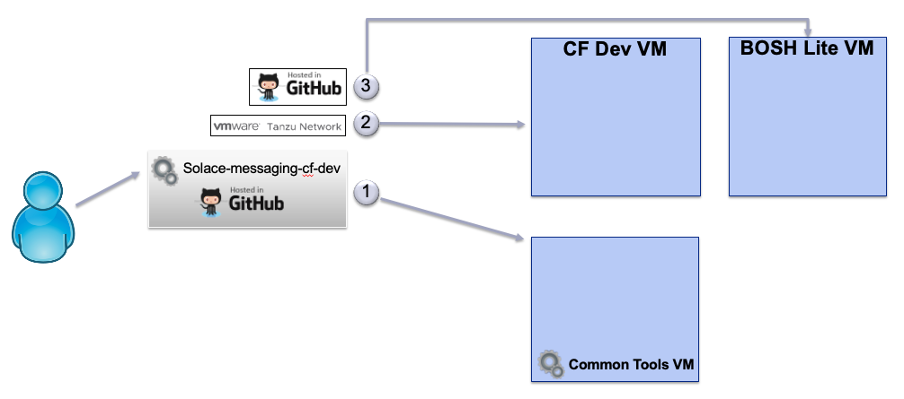
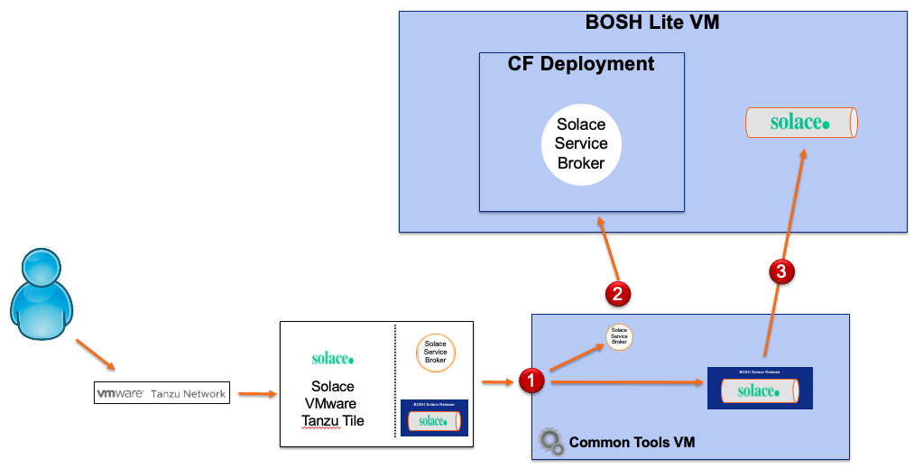

# SOLACE-MESSAGING-CF-DEV

This project provides instructions and tools to support installing and using a Solace Pivotal Tile 
on a local computer having enough resources.

This is an overview of what this project will help you install:

This guide will help you install the following VMs:

* cli-tools to provide a reliable environment to run the scripts of this project.
 - Tested with 512mb of ram, just enough to run some scripts. 
 - You may wish to increase the ram if you want to test applications from this VM. The setting for ram is in [config.yml](cli-tools/config.yml).
* PCF Dev for hosting the solace service broker and your applications.
 - Tested with 4GB, but you may size to suite your needs for hosting for your apps.
* BOSH-lite for hosting VMRs.
 - Size as recommended below to fit the VMRs.

## Current and future state

The initial version of this project will focus on re-using existing tools as standalone without attempting to merge them.
The project also includes a subset of scripts that may benefit from refactoring in a single solid codebase.

A future version of the project may attempt to use a single VM with all the tools. 

## Hardware Requirements

Each of the following requirements for tools and software products needs to be satisfied.

A key goal is to keep what is installed directly on your host computer to a minimum, while containing everything else inside VMs.
With this approach we keep a high level of containment within VMs and isolation from the host system.

RAM is biggest requirement, 16GB is the minimum, and 32GB is preferred.

## Installation 

The goal of the installation steps is to start the required VMs.

### Installation Requirements 

While there may be no need for internet access once the setup is completed, it is certainly required during the setup.
All the steps during the setup will access the internet to download and install correctly.

Directly on your computer, you need to:

* Install latest [Git](https://git-scm.com/downloads)
* Install latest [Virtual Box](https://www.virtualbox.org/wiki/Downloads)
* Install latest [Vagrant](https://www.vagrantup.com/downloads.htm)
* Shell access, use your preferred shell. 

_The setup was last tested on Windows host with 32GB of RAM, using:_
- git version 2.8.2.windows.1
- cf version 6.21.1+6fd3c9f-2016-08-10
- Vagrant 1.9.1
- VirtualBox Version 5.1.10 r112026 (Qt5.6.2)

### Installation Step 1 - Clone this project and start up its cli-tools vm

On your computer, clone this project and start up the cli-tools vm. We will come back to use it in later steps.

~~~~
git clone https://github.com/SolaceLabs/solace-messaging-cf-dev.git
cd solace-messaging-cf-dev
cd cli-tools
vagrant up
~~~~

Just an example on how to run commands in cli-tools vm, which you need to do later.
~~~~
cd solace-messaging-cf-dev
cd cli-tools
vagrant ssh

echo "I am running inside cli-tools vm"
exit
~~~~

_The cli-tools VM will contains all the necessary tools to run the scripts of this project, including 
another clone of this project. The workspace folder visible on your computer is shared with the cli-tools VM_

### Installation Step 2 - PCFDev

PCFDev provides a local installation of cloud foundry in a box to help test applications.

Using PCFDev you can install and test applications, bind to services that are available in PCFDev.

You can also add services to PCF Dev, such as solace-messaging and use solace-messaging with your applications.

Our goal is to to add solace-messaging as a service in PCFDev.

But first you need to install [PCFDev](https://pivotal.io/pcf-dev). Please follow these instructions:

* Install [cf cli - The Cloud Foundry Command Line Interface](https://pivotal.io/platform/pcf-tutorials/getting-started-with-pivotal-cloud-foundry-dev/install-the-cf-cli)
* Install [PCF Plugin which is used by cf cli](https://pivotal.io/platform/pcf-tutorials/getting-started-with-pivotal-cloud-foundry-dev/install-pcf-dev) 
* Start PCF Dev, using 4GB of ram. You may choose to adjust this.

~~~~
cf dev start -m 4096
~~~~

At this point PCFDev is locally installed and ready to host applications and services.

Optionally, you may follow the full [Getting started with pivotal cloud foundry introduction guide](https://pivotal.io/platform/pcf-tutorials/getting-started-with-pivotal-cloud-foundry-dev/introduction), as you would learn how to install a test application in PCFDev.

### Installation Step 3 - BOSH-lite

We will use [BOSH-lite](https://github.com/cloudfoundry/bosh-lite) to deploy the Solace VMR(s).

But first you need to install [BOSH-lite](https://github.com/cloudfoundry/bosh-lite) :

* By now you have already installed  [Virtual Box](https://www.virtualbox.org/wiki/Downloads) and [Vagrant](https://www.vagrantup.com/downloads.htm).
* Clone bosh-lite in the workspace of this project.

~~~~
cd solace-messaging-cf-dev
cd workspace
git clone https://github.com/cloudfoundry/bosh-lite
cd bosh-lite
~~~~

* Then start bosh-lite  
 - Use VM_MEMORY=5000 if you want to host a single VMR
 - Use VM_MEMORY=15000 if you want to host 3 VMRs that can form an HA Group

~~~~
VM_MEMORY=5000 vagrant up --provider=virtualbox
~~~~

* VERY IMPORTANT: enable routing so communication can work between your hosting computer and the VMs, one of these should work for you.
 - bosh-lite/bin/add-route 
 - bosh-lite/bin/add-route.bat 

_Without enabled routing, the VMs will not be able to communicate. You will have re-run the add-route* scripts if you reboot your computer_

## Solace Messaging Deployment

The goal of the deployment steps is to install Solace Messaging into the running PCF environment.

### Deployment - Prerequisites

#### The Solace Pivotal Tile

* The Solace Pivotal Tile is available for download from PivNet (https://network.pivotal.io/products/solace-messaging/).
* [Solace Pivotal Tile Documentation](http://docs.pivotal.io/partners/solace-messaging/)
- _You may use Solace Tiles for which we have matching [templates](./templates), 
   Installation will not work without templates to match the tile version_

Please download the Solace Pivotal Tile and keep it around for later use. 

For my example I have downloaded version 0.4.0 and placed it in:

~~~~
solace-messaging-cf-dev/workspace/solace-messaging-0.4.0.pivotal
~~~~

#### Login to cli-tools VM

All deployment steps require you to be logged in to the cli-tools VM 

~~~~
cd solace-messaging-cf-dev
cd cli-tools
vagrant ssh
~~~~

### Deployment Step 1 - Extract the contents of the Solace Pivotal Tile

The pivotal file is a zip file. We need to peel this onion to get the parts we need.

Use extract_tile.sh to extract the relevant contents we need.

~~~~
cd workspace
extract_tile.sh -t solace-messaging-0.4.0.pivotal
~~~~

You will find the relevant contents extracted to ~workspace/releases

### Deployment Step 2 - Install the Solace Service Broker on PCF Dev

installServiceBroker.sh script in cli-tools can do this for you:
- login to PCFDev
- install Service broker
- bind service broker to a mysql database
- add solace-messaging as a service in PCFDev
- show the contents of the marketplace at the end of the installation.

~~~~
installServiceBroker.sh 
~~~~

### Deployment Step 3 - Deploy VMR(s) to BOSH-lite

_Deploy only one and only once, you must use cleanup_bosh.sh if you want to re-deploy. if not sure what to pick just use the default with no parameters_

Example deploy the default which is "Shared-VMR" with a self-signed server certificate.

~~~~
bosh_deploy.sh
~~~~

Example deploy a Community-VMR with the cert template, which uses a self-signed server certificate.

~~~~
bosh_deploy.sh -p Community-VMR -t cert
~~~~

Example deploy a Medium-HA-VMR using the ha template, which requests 3 VMR instances and uses a self-signed server certificate.

~~~~
bosh_deploy.sh -p Medium-HA-VMR -t ha
~~~~

_Keep in mind that not all Tile Releases contain all solace-messaging service plans.
And that you may only deploy a single service plan which is controlled by the pool name (-p) to BOSH-lite.
The flag for the pool name (-p) will correspond to a service plan in the marketplace_

Pool name to service plan mapping:

- Shared-VMR => shared
- Large-VMR => large
- Community-VMR => community
- Medium-HA-VMR => medium-ha
- Large-HA-VMR => large-ha

## Using the Deployment

At this stage, solace-messaging is a service in PCFDev, and the BOSH-lite VMR deployment will auto register with the service broker
and become available for use in PCFDev.

_You can use 'cf' from cli-tools, or directly from your host computer, they both access the same PCFDev instance_

For example if you deployed the default Shared-VMR , a "shared" service plan will be available and you can do this:

~~~~
cf m
cf create-service solace-messaging shared test_shared_instance
cf services
cf delete-service -f test_shared_instance
cf services
~~~~

Ideally you will bind the service you created to an application and use it.
You can go ahead download and test the [Solace Sample Apps](https://github.com/SolaceLabs/sl-cf-solace-messaging-demo), or create some of your own.

# Other useful commands and tools

## How to login and access PCFDev

~~~~
cf api https://api.local.pcfdev.io --skip-ssl-validation
cf auth admin admin
~~~~

## How to see what is offered in the marketplace

~~~~
cf marketplace
~~~~

Or better yet, in short form:
~~~~
cf m
~~~~

## Service Broker

You can use your browser to examine the deployed [ service broker dashboard ](http://solace-messaging.local.pcfdev.io/)

You will need a username and password: solacedemo is the default as set in service-broker-manifest.yml obtained from [templates](./templates)

You can also run a script that will fetch a variety of information from the service broker
~~~~
getServiceBrokerInfo.sh
~~~~

## How to suspend and resume VMs

The VMS we created can be suspended and resumed at a later time. 
This way you don't need to recreate them. Their state is saved to disk.

### Suspending all VMS
~~~~
cd solace-messaging-cf-dev

cd cli-tools
vagrant suspend

cd ../workspace/bosh-lite
vagrant suspend

cf dev suspend
~~~~

### Resuming all VMS
~~~~
cd solace-messaging-cf-dev

cd cli-tools
vagrant resume

cd ../workspace/bosh-lite
vagrant resume

cf dev resume
~~~~

## Working with VMR in the BOSH-lite deployment

### Listing the VMs

From the cli-tools vm:

~~~~
bosh vms
~~~~

### Access the VMR cli

Get the list of vms, to find the IP address of the VMR instance you want:
~~~~
bosh vms
~~~~

Now ssh to the VMR, the default password is 'admin'.
_You can find the admin password and other goodies in the generated manifest in ~workspace/bosh-solace-manifest.yml_

~~~~
ssh -p 2222 admin@10.244.0.3
~~~~

## How to cleanup

### To remove a deployment from BOSH-lite

Use the same parameters with bosh_cleanup.sh as the one you did with bosh_deploy.sh.

_If you remove a deployment from BOSH-lite the service-broker inventory will be out-of-sync with the deployment.
Just re-install the service broker to reset everything._

~~~~
bosh_cleanup.sh -p Shared-VMR -t cert
installServiceBroker.sh 
~~~~

### How to delete BOSH-lite VM

On your host computer (not cli-tools)

~~~~
cd solace-messaging-cf-dev
cd workspace
cd bosh-lite
vagrant destroy
~~~~

### How to delete cli-tools VM

On your host computer (not cli-tools)

~~~~
cd solace-messaging-cf-dev
cd cli-tools
vagrant destroy
~~~~

### How to delete PCF Dev

On your host computer (not cli-tools)

~~~~
cf dev destroy
~~~~

